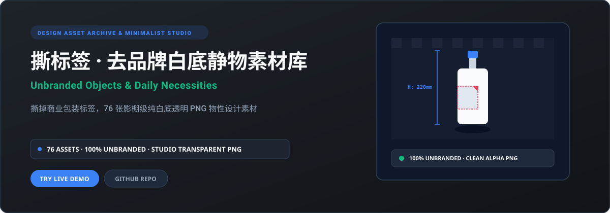
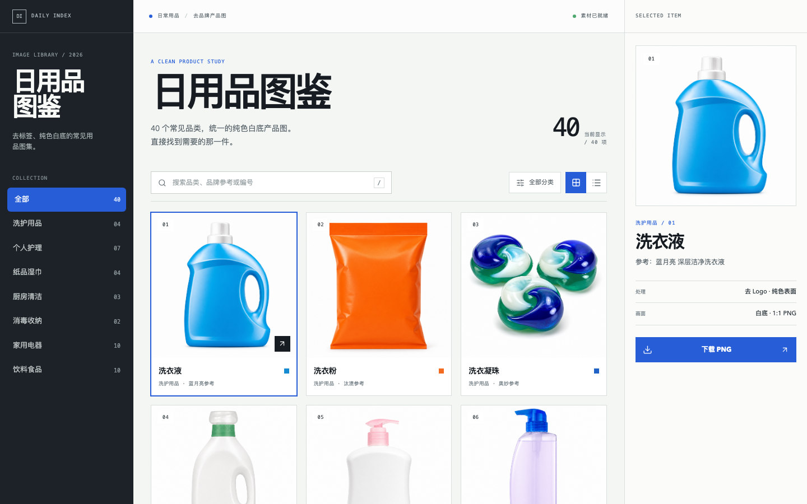

<p align="right">
  <a href="./README.md">简体中文</a> · <strong>English</strong>
</p>

<p align="center">
  
</p>

<p align="center">
  <a href="https://daily-necessities-library.xiaosang.cc/"><strong>🌐 Live Demo (Primary)</strong></a> · 
  <a href="https://holynova.github.io/daily-necessities-library/"><strong>🚀 Mirror (GitHub Pages)</strong></a> · 
  <a href="https://github.com/holynova/daily-necessities-library"><strong>📦 GitHub Source</strong></a> · 
  <a href="https://xiaosang.cc/"><strong>✨ Portfolio</strong></a>
</p>

---

## Proof of Work

<p align="center">
  
</p>

---

## What It Is

Stripping away all logos, barcodes, and packaging clutter to spotlight the pure form, material, and softbox illumination of everyday items. Includes 76 high-resolution transparent PNG assets across daily amenities, bottled beverages, groceries, and 14 curated desktop still-life collections.

---

## Why It Matters (Key Features)

- **Complete De-branding Treatment**: Eliminates commercial logos and marketing stickers to celebrate geometric purity and product tactile nature.
- **Studio Softbox Illumination**: Dual-side diffused lights with top softbox preserving natural highlights and clean contact shadows.
- **Sub-pixel Transparent Cutouts**: Accurately renders translucent liquids, glass refraction, and crisp silhouettes ready for compositing.
- **Multi-dimensional Filtering**: Fast search, category tags, light/dark canvas inspection, and instant one-click downloads.

---

## Inventory & Scope

Everyday amenities, beverages & groceries, 6 corporate office suites, and 14 arranged desktop still life groups.

---

## Quick Start

### 1. Live Demos
Experience it directly in your browser without any setup:
- 🌐 **Primary Demo**: [https://daily-necessities-library.xiaosang.cc/](https://daily-necessities-library.xiaosang.cc/)
- 🚀 **Alternative Mirror (GitHub Pages)**: [https://holynova.github.io/daily-necessities-library/](https://holynova.github.io/daily-necessities-library/)

### 2. Local Development
Clone the repository and launch locally:

```bash
git clone https://github.com/holynova/daily-necessities-library.git
cd daily-necessities-library
npm install && npm run dev
```

---

## License & Author

- **Author**: [holynova (Xiaosang)](https://xiaosang.cc/)
- **License**: [MIT License](./LICENSE)
- **Featured Collection**: Curated as part of [Where Craft Lives (xiaosang.cc)](https://xiaosang.cc/).
