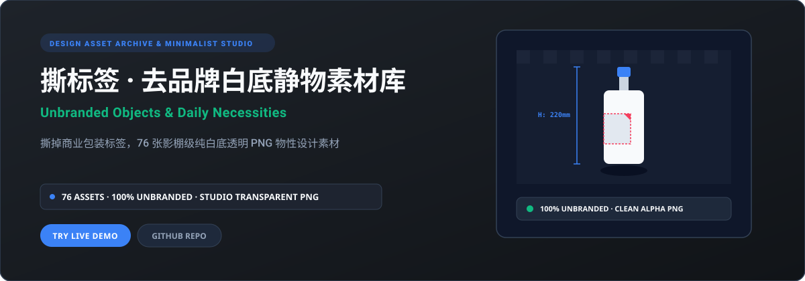

<p align="right"><strong>简体中文</strong> · <a href="./README.en.md">English</a></p>

<p align="center"></p>

# 撕标签 · Wander

116 张去标签产品 PNG 与 21 组桌面静物合集，包含 40 张新增快销品。Wander 界面以橄榄绿分类标签、双列瀑布流和底部导航浏览日常素材，首页合集优先，图片按原始比例显示；列表懒加载缩略图，详情解码后切换高清 WebP，下载保留原图。**当前版本：1.1.2。**

[在线体验](https://daily-necessities-library.xiaosang.cc/) · [GitHub 源码](https://github.com/holynova/daily-necessities-library) · [备用镜像](https://holynova.github.io/daily-necessities-library/) · [更多作品](https://xiaosang.cc/)

<p align="center"></p>

- 分类目录、全库搜索、推荐 / 最新 / 名称排序。
- 浏览器本地收藏、原图下载、分享二维码及 PNG 海报导出。
- 首批 12 张，滚动追加；列表使用 WebP 缩略图，详情解码后升级为高清 WebP，下载仍取 PNG 原图。
- 桌面四列、手机双列；支持键盘翻图、触摸滑动和减少动态效果。

图片名称与品牌参考沿用现有素材元信息，下载保留原始白底 PNG。

## 运行与发布

```bash
npm ci
npm run dev
npm run build:static
npm run deploy:check
npm run deploy
```

源码与配置统一维护在 `master`。Cloudflare Worker 为 `daily-necessities-library`，使用上述命令从本地主分支手动发布。原有 GitHub Pages 镜像流程保留。

<p align="center"></p>

作者：[holynova](https://github.com/holynova)。
